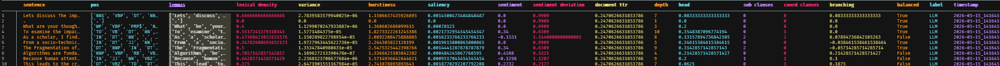
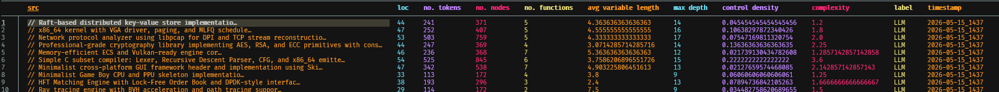

# Lexi Frame LLM and Natural Language Dataframe Compiler 
## Streamlined generation of LLM and human language and code

### *repo includes multiple different toolkits, with an example usecase combining all modules in main.py*

**TO INSTALL:**

``` bash
git clone "https://github.com/samAmabile/Lexi.git"
cd Lexi
pip install -r requirements.txt
```

**TO RUN:**

```bash
python -m spacy download en_core_web_sm
python main.py
```

### Modules:

#### gemini.py

* Chat and Automate:

To Use:
``` 
from gemini import Chat, Automate 
```
Offers both manual *(Chat)* and automated *(Automate)* chat with Gemini models, with automatic capture of history in a csv. 

* Code:

To Use:

```
from gemini import Code
```
Offers both manual and automated generation of single code instances (one prompt) or large codebases (from default prompt lists or generated prompts)

Automatically saves sessions to a dataframe. 

#### encorporate.py

* Encorporator:

To Use:
```
from encorporate import Encorporator
```
Builds dataframe corpora from text (string) inputs with lexical, syntactic, and semantic data. 

*Encorporator Dataframe*


* Codecorpus:

To Use:
```
from encorporate import Codecorpus
```
Builds dataframes of code with detailed analysis from *TreeSitter* and *Lizard* libraries

*Codecorpus Dataframe*


### dataset\_builder.py 

Leverages *gemini.py* and *encorporate.py* along with **NLTK** and **Hugging Face** to build paired datasets of LLM/human content for both prose and code

To Use:
```
from dataset_builder import data_generator
```


