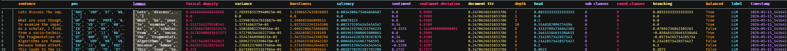
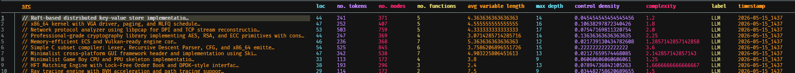

# Lexi Frame LLM and Natural Language Dataframe Compiler 
## Streamlined generation of LLM and human language and code

***repo includes multiple different toolkits, with an example of dataset building in main.py and an example of a model trained on data from the pipeline in classifier.py***

**TO INSTALL:**

``` bash
git clone "https://github.com/samAmabile/Lexi.git"
cd Lexi
pip install -r requirements.txt
```

**TO RUN:**

```bash
python -m spacy download en_core_web_sm
python main.py
```

### Modules:

#### **`gemini.py`**

* *`Chat and Automate:`*

To Use:
``` python
from gemini import Chat, Automate 
```
>Offers both manual *(`Chat`)* and automated *(`Automate`)* chat with Gemini models, with automatic capture of history in a csv. 

* *`Code:`*

To Use:

```python
from gemini import Code
```
> Offers both manual and automated generation of single code instances (one prompt) or large codebases (from default prompt lists or generated prompts)

Automatically saves sessions to a dataframe. 

#### **`encorporate.py`**

* *`Encorporator:`*

To Use:
```python
from encorporate import Encorporator
```
> Builds dataframe corpora from text (string) inputs with lexical, syntactic, and semantic data. 

*Encorporator Dataframe*


* *`Codecorpus:`*

To Use:
```python
from encorporate import Codecorpus
```
> Builds dataframes of code with detailed analysis from *TreeSitter* and *Lizard* libraries

*Codecorpus Dataframe*


#### **`dataset_builder.py`**

> Leverages *gemini.py* and *encorporate.py* along with **NLTK** and **Hugging Face** to build paired datasets of LLM/human content for both prose and code

To Use:
```python
from dataset_builder import data_generator
from dataset_builder import dataset_builder, dataset_builder_ai
```
#### **`classifier.py`**

> Includes a model trained using the above data collection pipelines to detect human vs ai text. 

To Use:
```python
from classifier import Classifier()
#to classify a single document: 
model = Classifier()
text = "<...your text sample here...>"
model.classify(text) 
#returns 'LLM' or 'HUMAN' and a probability for each category
```
